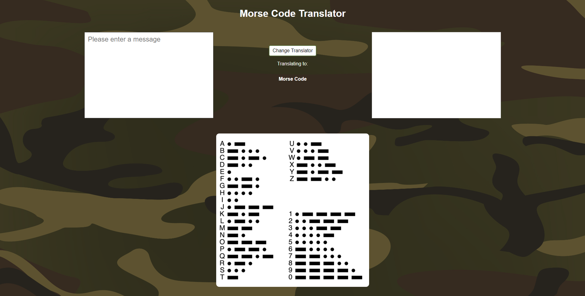
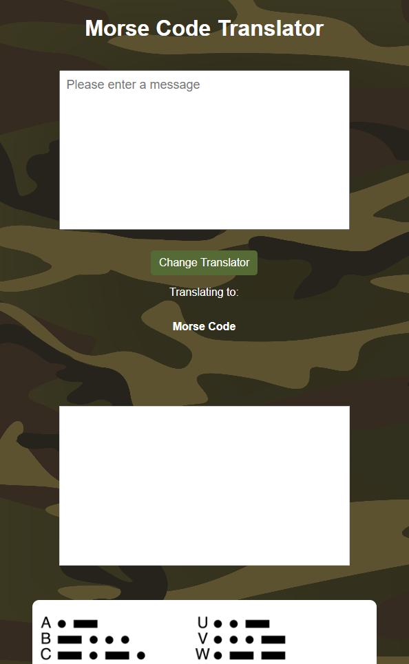

# morse-code-translator-project

## Preview

### Desktop

### Mobile

## Deployed Version

* [Link]( https://morse-code-translator-project.vercel.app/)

## Setup

* Open index.html with live server
* [Link to download live server for VScode]( https://marketplace.visualstudio.com/items?itemName=ritwickdey.LiveServer)

### Testing
* To install dependencies open terminal cd into the root folder
`npm install`

* Run Tests
`npm run test`
  

## Description of project (spec / MVP)

### Requirement
* HTML
* CSS
* SASS
* Javascript
* Jest

### MVP:

* Create a user interface that allows the user to either input some English text or some Morse Code

* Create JS functions that would allow the user to:

...translate their English text into Morse Code..
...Morse Code into English text..
* Make sure to handle spaces properly (ie. there is 1 space between English words, but one space between Morse Code characters)

* Bonus: Handle other characters as well

* Bonus: Detect if a piece of text is english or morse and translate accordingly

* Split your code between data, logic functions and dom functions

* Develop unit tests for all of your logic functions

* Explore and discover edge cases in your code to further develop your tests

## Approach

* Broke the app into smaller sections and work on each small feature one by one eg. Working on taskbar, clock, startmenu, each small app one at a time.
* Research ideas online that I didnt have a good understanding of eg. Draggable windows
* This was made with Javascript instead of other frameworks to solidify my understanding of how to select elements in the DOM and to manipulate them, to give functionality or change styling.
* Tried to keep things modular with styles seperate in their own component files and linked to one file with sass, Javascript files were seperated logc files and DOM files.

## Reflection

*  What went well?  Reference images were availiable online so I felt that the styling process was easier and went well.
*  What are you proud of? I am proud that the paint app works as serveral bugs and debugs occured when building the application.
*  What was a challenge? Making the windows draggable as trying to implement the function I was selecting the wrong elements and breaking the code.
*  What you'd do differently? Try to create the rendering of the applications be done in reusable javascript code instead of hard-coding and hiding the divs.

## Future Goals

* Add more applications, eg. Photo gallery app
* Using DRY create DOM functions that render applications dymanically.
* Add testing for logic components
* Make the taskbar applications focus when it is clicked

## Further reading or links to inspiration

*  [DOM CheatSheet]( https://fundamentals.generalassemb.ly/11_unit/dom-cheatsheet.html)
*  [Code WET or DRY?]( https://dzone.com/articles/is-your-code-dry-or-wet#:~:text=DRY%20code%20is%20a%20software,t%20adhere%20to%20DRY%20principle.)
*  [Breaking Down Monster Projects]( https://www.informit.com/articles/article.aspx?p=2153472)

## Stay in touch

*  [Portfolio]( https://edric-khoo.vercel.app/)
*  [Linkedin]( https://www.linkedin.com/in/edric-khoo-98881b173/)

